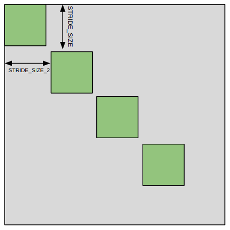
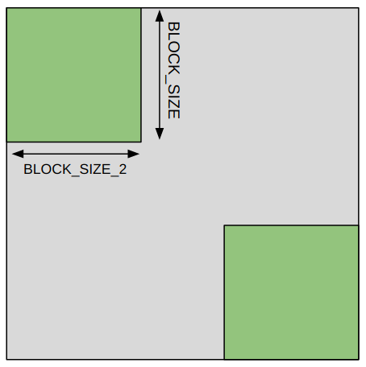
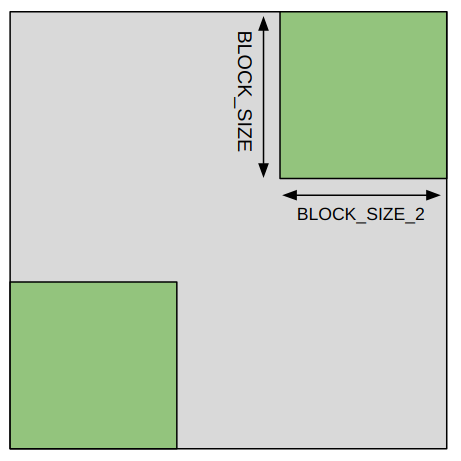
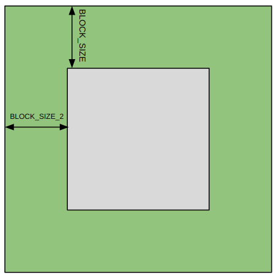

## Additions to H5Bench_read
4 new patterns are added to the h5bench read benchmark:
1. CS: Refers to the Cross Stencil data access pattern. A block of fixed sides is used to read data from an HDF5 dataset. This block is given a fixed stride in each dimension and data till end of dataset is read.
2. LDC: Refers to the Left Diagonal Corner data access pattern. Data is read from two identical blocks of fixed sides, one in the top left corner and the other in the bottom right corner in the 2D HDF5 dataset
3. RDC: Refers to the Right Diagonal Corner data access pattern. Data is read from two identical blocks of fixed sides, one in the top right corner and the other in the bottom left corner in the 2D HDF5 dataset
4. PRL: Refers to the Peripheral data access pattern. Data is read from the periphery of the dataset, which is a frame of fixed width and height around the dataset.

These patterns work with a single MPI process. In case multiple processes are used, only the root performs the read operations and all other processes skip the reads. Illustrations of the patterns are given in the table below: 

| Pattern -> | CS | LDC | RDC | PRL |  
| ---------- | ---------- | ---------- | ---------- | ---------- |  
|Illustration |  |  |  |  |  

Steps for running these benchmarks are the same as the other benchmarks. All parameter and requirements and running instructions remain same, except for the following parameters which are additionally required to be provided in the configuration:
1. CS  
    | Parameter | Description |  
    | --------- | ----------- |  
    | `BLOCK_SIZE` | Size of the block of data along `dim_1` |  
    | `BLOCK_SIZE_2` | Size of the block of data along `dim_2` |  
    | `STRIDE_SIZE` | Stride of the block of data along `dim_1` |  
    | `STRIDE_SIZE_2` | Stride of the block of data along `dim_2` |  

2. LDC/RDC
    | Parameter | Description |  
    | --------- | ----------- |  
    | `BLOCK_SIZE` | Size of the block of data along `dim_1` |  
    | `BLOCK_SIZE_2` | Size of the block of data along `dim_2` |  

3. PRL  
    | Parameter | Description |  
    | --------- | ----------- |  
    | `BLOCK_SIZE` | Size of the frame along `dim_1` |  
    | `BLOCK_SIZE_2` | Size of the frame along `dim_2` |  

Exmaples of some configurations are provided in `h5bench/samples/sync-write-1d-contig-contig-read-<pattern>.json`